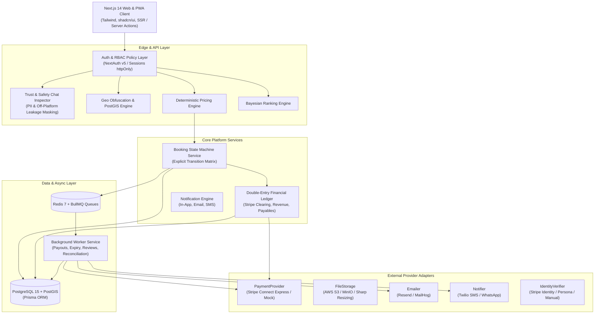
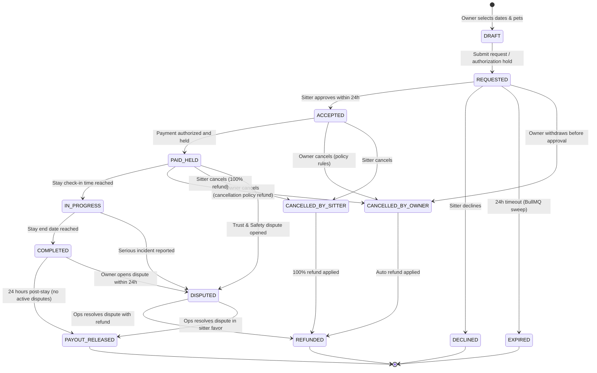

# PawStay Platform Architecture

## System Component Overview

```mermaid
graph TD
    Client["Next.js 14 Web & PWA Client<br/>(Tailwind, shadcn/ui, SSR / Server Actions)"]
    
    subgraph Edge & API Layer
        AuthMiddleware["Auth & RBAC Policy Layer<br/>(NextAuth v5 / Sessions httpOnly)"]
        ChatFilter["Trust & Safety Chat Inspector<br/>(PII & Off-Platform Leakage Masking)"]
        GeoEngine["Geo Obfuscation & PostGIS Engine"]
        PriceEngine["Deterministic Pricing Engine"]
        RankingEngine["Bayesian Ranking Engine"]
    end

    subgraph Core Platform Services
        StateMachine["Booking State Machine Service<br/>(Explicit Transition Matrix)"]
        LedgerService["Double-Entry Financial Ledger<br/>(Stripe Clearing, Revenue, Payables)"]
        NotificationHub["Notification Engine<br/>(In-App, Email, SMS)"]
    end

    subgraph Data & Async Layer
        DB[("PostgreSQL 15 + PostGIS<br/>(Prisma ORM)")]
        RedisQueue[("Redis 7 + BullMQ Queues")]
        Worker["Background Worker Service<br/>(Payouts, Expiry, Reviews, Reconciliation)"]
    end

    subgraph External Provider Adapters
        StripeAdapter["PaymentProvider<br/>(Stripe Connect Express / Mock)"]
        S3Adapter["FileStorage<br/>(AWS S3 / MinIO / Sharp Resizing)"]
        EmailAdapter["Emailer<br/>(Resend / MailHog)"]
        SMSAdapter["Notifier<br/>(Twilio SMS / WhatsApp)"]
        IdentityAdapter["IdentityVerifier<br/>(Stripe Identity / Persona / Manual)"]
    end

    Client --> AuthMiddleware
    AuthMiddleware --> ChatFilter
    AuthMiddleware --> GeoEngine
    AuthMiddleware --> PriceEngine
    AuthMiddleware --> RankingEngine

    PriceEngine --> StateMachine
    StateMachine --> LedgerService
    StateMachine --> DB
    StateMachine --> RedisQueue

    LedgerService --> DB
    LedgerService --> StripeAdapter

    RedisQueue --> Worker
    Worker --> DB
    Worker --> StripeAdapter
    Worker --> EmailAdapter
    Worker --> SMSAdapter
```

## Booking State Transition Machine

```mermaid
stateDiagram-v2
    [*] --> DRAFT : Owner selects dates & pets
    DRAFT --> REQUESTED : Submit request / authorization hold
    
    REQUESTED --> ACCEPTED : Sitter approves within 24h
    REQUESTED --> DECLINED : Sitter declines
    REQUESTED --> EXPIRED : 24h timeout (BullMQ sweep)
    REQUESTED --> CANCELLED_BY_OWNER : Owner withdraws before approval
    
    ACCEPTED --> PAID_HELD : Payment authorized and held
    ACCEPTED --> CANCELLED_BY_OWNER : Owner cancels (policy rules)
    ACCEPTED --> CANCELLED_BY_SITTER : Sitter cancels
    
    PAID_HELD --> IN_PROGRESS : Stay check-in time reached
    PAID_HELD --> CANCELLED_BY_OWNER : Owner cancels (cancellation policy refund)
    PAID_HELD --> CANCELLED_BY_SITTER : Sitter cancels (100% refund)
    PAID_HELD --> DISPUTED : Trust & Safety dispute opened
    
    IN_PROGRESS --> COMPLETED : Stay end date reached
    IN_PROGRESS --> DISPUTED : Serious incident reported
    
    COMPLETED --> PAYOUT_RELEASED : 24 hours post-stay (no active disputes)
    COMPLETED --> DISPUTED : Owner opens dispute within 24h
    
    CANCELLED_BY_OWNER --> REFUNDED : Auto refund applied
    CANCELLED_BY_SITTER --> REFUNDED : 100% refund applied
    DISPUTED --> REFUNDED : Ops resolves dispute with refund
    DISPUTED --> PAYOUT_RELEASED : Ops resolves dispute in sitter favor
    
    PAYOUT_RELEASED --> [*]
    DECLINED --> [*]
    EXPIRED --> [*]
    REFUNDED --> [*]
```
