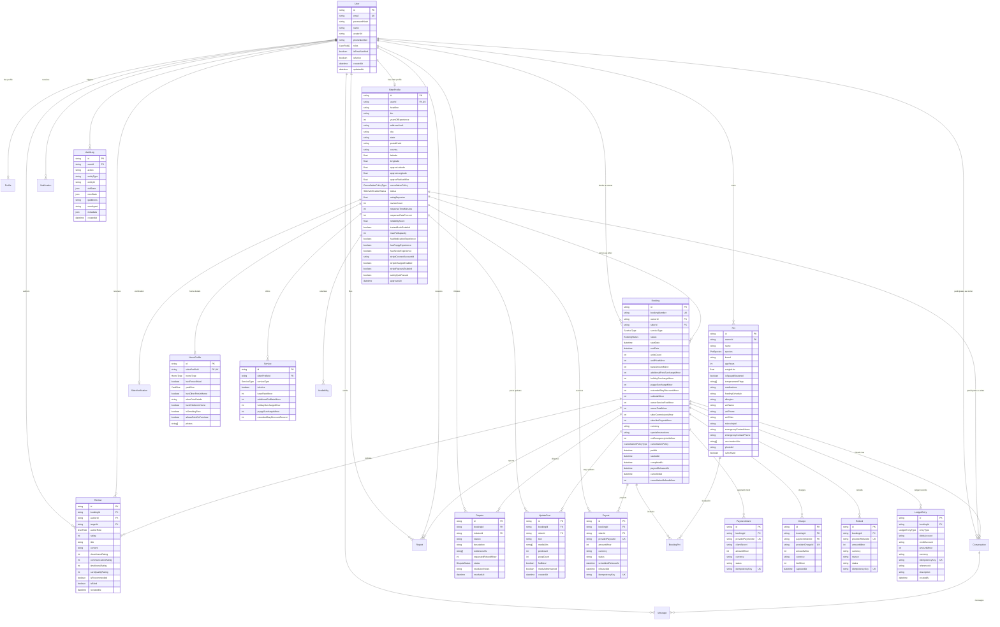

# PawStay Domain Entity Relationship Diagram (ERD)

This document visualizes the complete database schema for PawStay, engineered for PostgreSQL 15+ with PostGIS extensions.

```mermaid
erDiagram
    User ||--o| Profile : "has profile"
    User ||--o| SitterProfile : "has sitter profile"
    User ||--o{ Pet : "owns"
    User ||--o{ Booking : "books as owner"
    User ||--o{ Review : "authors"
    User ||--o{ Review : "receives"
    User ||--o{ Message : "sends"
    User ||--o{ Conversation : "participates as owner"
    User ||--o{ Notification : "receives"
    User ||--o{ AuditLog : "triggers"
    User ||--o{ Report : "files"
    User ||--o{ Report : "receives"
    User ||--o{ Dispute : "initiates"

    SitterProfile ||--o| SitterVerification : "verification"
    SitterProfile ||--o| HomeProfile : "home details"
    SitterProfile ||--o{ Service : "offers"
    SitterProfile ||--o{ Availability : "calendar"
    SitterProfile ||--o{ Booking : "serves as sitter"
    SitterProfile ||--o{ Conversation : "participates as sitter"
    SitterProfile ||--o{ UpdatePost : "posts updates"
    SitterProfile ||--o{ Payout : "receives"

    Booking ||--o{ BookingPet : "includes"
    Pet ||--o{ BookingPet : "booked in"

    Booking ||--o{ PaymentIntent : "payment intent"
    Booking ||--o{ Charge : "charges"
    Booking ||--o{ Payout : "payouts"
    Booking ||--o{ Refund : "refunds"
    Booking ||--o{ LedgerEntry : "ledger records"
    Booking ||--o{ Review : "reviews"
    Booking ||--o{ UpdatePost : "stay updates"
    Booking ||--o{ Dispute : "disputes"
    Booking ||--o{ Report : "reports"
    Booking ||--o| Conversation : "linked chat"

    Conversation ||--o{ Message : "messages"

    User {
        string id PK
        string email UK
        string passwordHash
        string name
        string avatarUrl
        string phoneNumber
        UserRole[] roles
        boolean isEmailVerified
        boolean isActive
        datetime createdAt
        datetime updatedAt
    }

    SitterProfile {
        string id PK
        string userId FK,UK
        string headline
        string bio
        int yearsOfExperience
        string addressLine1
        string city
        string state
        string postalCode
        string country
        float latitude
        float longitude
        float approxLatitude
        float approxLongitude
        float approxRadiusMiles
        CancellationPolicyType cancellationPolicy
        SitterVerificationStatus status
        float ratingBayesian
        int reviewCount
        int responseTimeMinutes
        int responseRatePercent
        float reliabilityScore
        boolean instantBookEnabled
        int maxPetCapacity
        boolean hasMedicationExperience
        boolean hasPuppyExperience
        boolean hasSeniorExperience
        string stripeConnectAccountId
        boolean stripeChargesEnabled
        boolean stripePayoutsEnabled
        boolean safetyQuizPassed
        datetime approvedAt
    }

    HomeProfile {
        string id PK
        string sitterProfileId FK,UK
        HomeType homeType
        boolean hasFencedYard
        YardSize yardSize
        boolean hasOtherPetsInHome
        string otherPetsDetails
        boolean hasChildrenInHome
        boolean isSmokingFree
        boolean allowsPetsOnFurniture
        string[] photos
    }

    Service {
        string id PK
        string sitterProfileId FK
        ServiceType serviceType
        boolean isActive
        int baseRateMinor
        int additionalPetRateMinor
        int holidaySurchargeMinor
        int puppySurchargeMinor
        int extendedStayDiscountPercent
    }

    Pet {
        string id PK
        string ownerId FK
        string name
        PetSpecies species
        string breed
        int ageYears
        float weightLbs
        boolean isSpayedNeutered
        string[] temperamentFlags
        string medications
        string feedingSchedule
        string allergies
        string vetName
        string vetPhone
        string vetClinic
        string microchipId
        string emergencyContactName
        string emergencyContactPhone
        string[] vaccinationUrls
        string photoUrl
        boolean isArchived
    }

    Booking {
        string id PK
        string bookingNumber UK
        string ownerId FK
        string sitterId FK
        ServiceType serviceType
        BookingStatus status
        datetime startDate
        datetime endDate
        int unitsCount
        int unitPriceMinor
        int baseAmountMinor
        int additionalPetsSurchargeMinor
        int holidaySurchargeMinor
        int puppySurchargeMinor
        int extendedStayDiscountMinor
        int subtotalMinor
        int ownerServiceFeeMinor
        int ownerTotalMinor
        int sitterCommissionMinor
        int sitterNetPayoutMinor
        string currency
        string specialInstructions
        int vetEmergencyLimitMinor
        CancellationPolicyType cancellationPolicy
        datetime paidAt
        datetime startedAt
        datetime completedAt
        datetime payoutReleasedAt
        datetime cancelledAt
        int cancellationRefundMinor
    }

    PaymentIntent {
        string id PK
        string bookingId FK
        string providerPaymentId UK
        string clientSecret
        int amountMinor
        string currency
        string status
        string idempotencyKey UK
    }

    Charge {
        string id PK
        string bookingId FK
        string paymentIntentId FK
        string providerChargeId UK
        int amountMinor
        string currency
        int feeMinor
        datetime capturedAt
    }

    Payout {
        string id PK
        string bookingId FK
        string sitterId FK
        string providerPayoutId UK
        int amountMinor
        string currency
        string status
        datetime scheduledReleaseAt
        datetime releasedAt
        string idempotencyKey UK
    }

    Refund {
        string id PK
        string bookingId FK
        string providerRefundId UK
        int amountMinor
        string currency
        string reason
        string status
        string idempotencyKey UK
    }

    LedgerEntry {
        string id PK
        string bookingId FK
        LedgerEntryType entryType
        string debitAccount
        string creditAccount
        int amountMinor
        string currency
        string idempotencyKey UK
        string referenceId
        string description
        datetime createdAt
    }

    Review {
        string id PK
        string bookingId FK
        string authorId FK
        string targetId FK
        UserRole authorRole
        int rating
        string title
        string content
        int cleanlinessRating
        int communicationRating
        int timelinessRating
        int careQualityRating
        boolean isRecommended
        boolean isBlind
        datetime revealedAt
    }

    UpdatePost {
        string id PK
        string bookingId FK
        string sitterId FK
        string text
        string[] mediaUrls
        int peeCount
        int poopCount
        boolean fedMeal
        boolean medsAdministered
        datetime createdAt
    }

    Dispute {
        string id PK
        string bookingId FK
        string initiatorId FK
        string reason
        string description
        string[] evidenceUrls
        int requestedRefundMinor
        DisputeStatus status
        string resolutionNotes
        datetime resolvedAt
    }

    AuditLog {
        string id PK
        string userId FK
        string action
        string entityType
        string entityId
        json oldState
        json newState
        string ipAddress
        string userAgent
        json metadata
        datetime createdAt
    }
```
